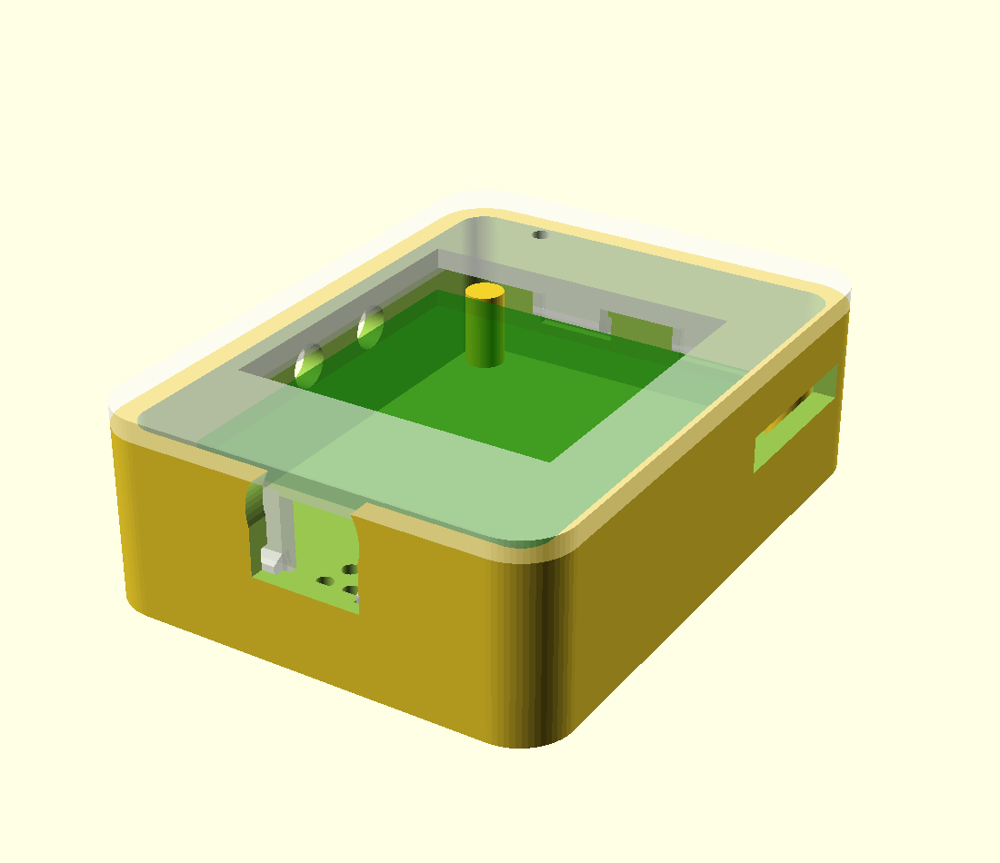
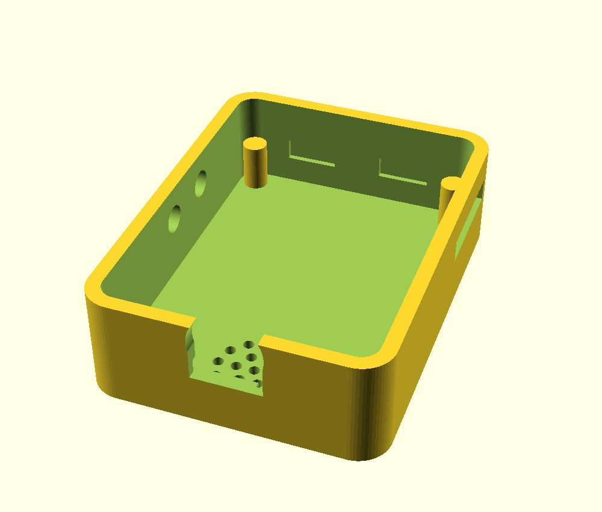
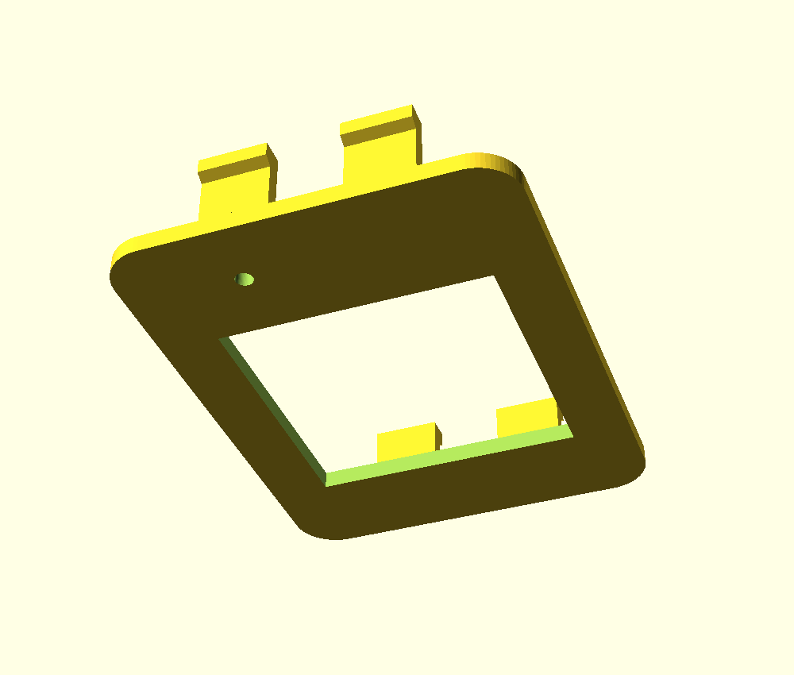

# Snap-fit enclosure

Two printed parts, no screws and no inserts: a back tub that holds the board, and a front bezel that clips over it on six cantilever hooks.

```
openscad -o back.stl  -D 'part="back"'  mono-note-mini.scad
openscad -o front.stl -D 'part="front"' mono-note-mini.scad
```

Open the file in [OpenSCAD](https://openscad.org) and set `part` to `"assembly"` to see it together, or `"plate"` to lay both out for printing.

## The board already comes in a case

Worth knowing before printing anything: the ESP32-S3-ePaper-1.54 **ships inside a finished white enclosure**, closed with two screws on the back. This model is a *replacement* for it, not the only way to house the board — if the stock case is fine, you do not need this at all.

What it changes is how it opens. Two screws become six snap hooks and a thumb notch, so you can get at the SD card without a driver.

## What is known, and what is not

**Known**, from Waveshare's outline drawing, and used directly:

| | mm |
|---|---|
| Outside | 39.80 × 53.00 × 16.90 |
| Corner radius | R4.50 |
| Display window | 27.80 square |
| Window position | centred horizontally, 14.30 up from the bottom edge |

The device is **portrait** — taller than it is wide. The glass itself is 200 px at 0.138 mm pitch = 27.6 mm, so the 27.80 window already carries 0.1 mm of margin per side. The aperture exposes all of it deliberately: the UI puts its back button in the bottom rows of the panel, so a bezel lapping even 2 mm over the display would sit on a control.

**Not known.** Waveshare dimensions the cased product and never the bare PCB, so everything in the `ASSUMED` block still waits on calipers:

| Variable | What to measure |
|---|---|
| `pcb_w`, `pcb_h` | PCB outline, corner to corner |
| `pcb_bottom` | from the case's bottom edge to the bottom of the PCB |
| `front_stack` | tallest thing on the display side, from the PCB face |
| `back_stack` | tallest thing on the back — TF socket, battery header or speaker |
| `btn_side`, `btn_boot_z`, `btn_pwr_z` | which edge the side buttons are on, and how far up |
| `usb_x` | USB-C centre along the bottom edge |
| `tf_z` | TF slot height up the right edge |
| `mic_x/y`, `spk_x/y` | microphone and speaker positions |

The outside will be the right size and shape as printed. The inside will not hold the board correctly until those are measured.

## Printing

- **0.2 mm layers, 3 perimeters, 20% infill.** No supports needed: the hooks print standing up off the bezel face and the port cutouts are all on vertical walls.
- **PETG or PLA.** PETG flexes further before yielding, which suits snap hooks; PLA works but be gentler on the first assembly. Avoid brittle filled filaments — carbon-fill will crack the hooks.
- Print the bezel **face down** so the visible surface is the smooth plate side.

## How the snap works

Six cantilever hooks on the bezel catch grooves in the tub wall: two per long side, one per short side. `hook_len` is what keeps them alive — a 6.5 mm beam deflecting 0.9 mm stays inside PLA's elastic range, where a 3 mm beam doing the same job would stress-whiten and snap off after a few openings.

To take it apart, push a thumbnail into the notch on the bottom edge and lift. If it opens too easily, raise `hook_catch` by 0.1 mm at a time; if it will not close, raise `hook_clear` instead.



Back tub and front bezel:

 

## Verified geometry

Both parts render and export cleanly, and the meshes were checked directly:

| | back tub | front bezel |
|---|---|---|
| Triangles | 7204 | 1220 |
| Connected shells | 1 | 1 |
| Non-manifold edges | 0 / 10806 | 0 / 1830 |
| Footprint | 39.80 × 53.00 | 39.80 × 53.00 |
| Height | 15.10 | 1.80 + fingers |

15.10 + 1.80 = **16.90 mm assembled**, matching Waveshare's depth exactly, and neither part exceeds the footprint — the bezel plugs *into* the tub, so nothing protrudes.

## Still not verified

**Nothing has been printed.** The geometry is sound and the outside is the right size, but the internals rest on the assumed board dimensions above. Treat the first print as a draft-quality fit test.
